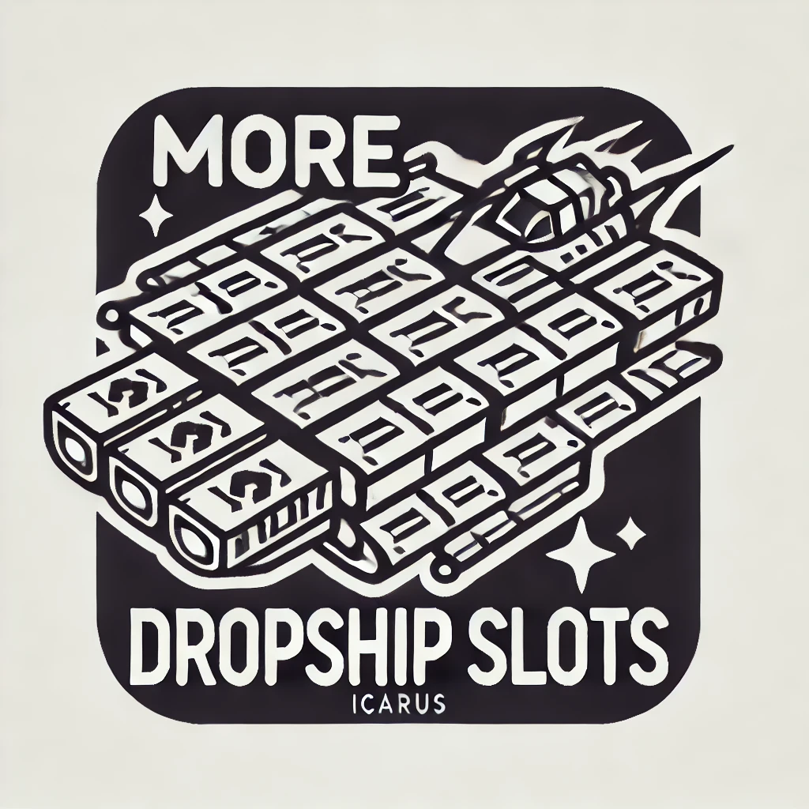
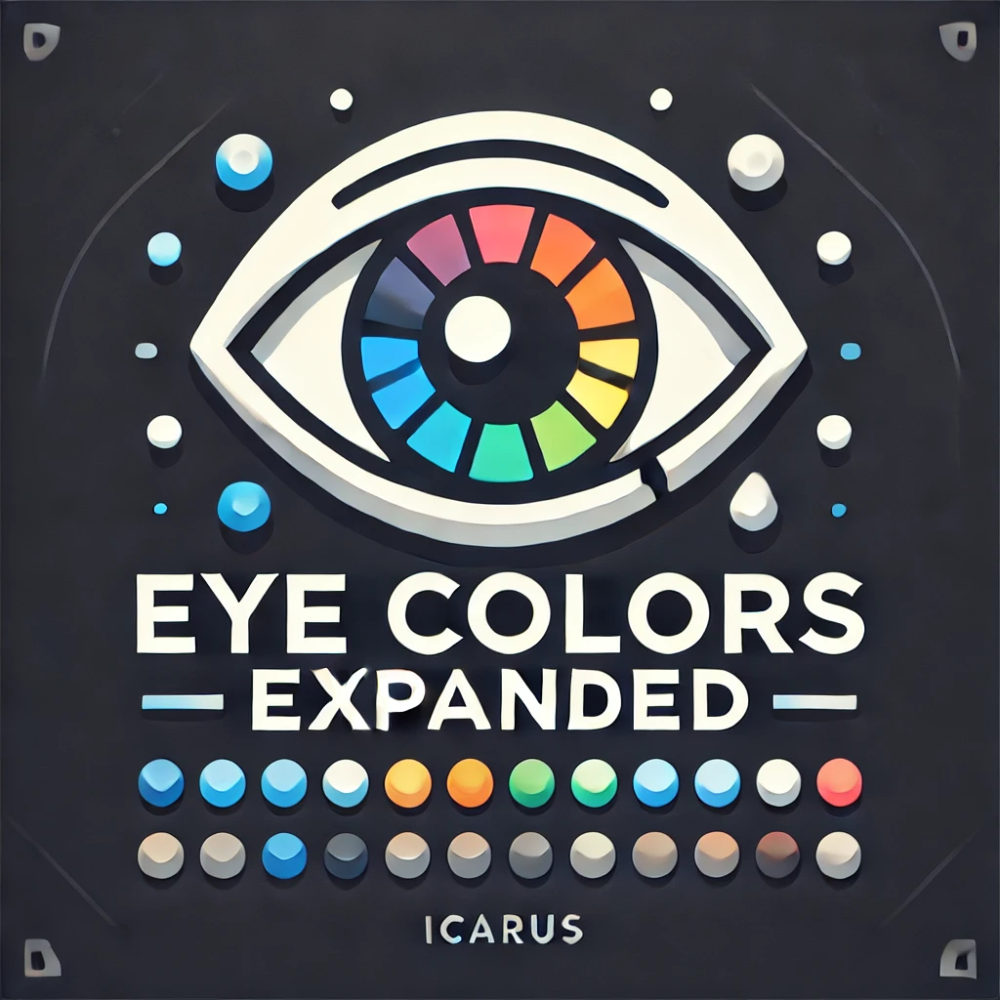

# Bostonstrong567's Icarus Mods

Welcome to my repository for my Icarus mods!

## Mods

1.  [More DropShip Slots!](Mods/More%20Drop%20Ship%20Slots)
2.  [Eye Colors Expanded!](Mods/Eye%20Colors%20Expanded!)

## Installations

### Automatic Installation

For automatic installation, do the following:

1. Open [Icarus Mod Manager](https://projectdaedalus.app/tools).
2. Download only the `.EXMODZ` from [the selected mod](Mods).
3. Click `Import EXMODZ File`.

    

4. Select the `.EXMODZ` you downloaded.
5. Launch the game and enjoy.

### Manual Installation

If you don't own [Icarus Mod Manager](https://projectdaedalus.app/tools), I recommend you download it.

For manual installation, do the following:

1. Download only the `.pak` from [the selected mod](Mods).
2. Extract the contents of the zip file to your Icarus game directory using a tool such as [7zip](https://www.7-zip.org).
3. Move the `.pak` file to the `\Icarus\Icarus\Content\Paks\mods` directory. If the `mods` folder doesn't exist, create one inside `\Icarus\Icarus\Content\Paks\` called `mods`.
4. Launch the game and enjoy.

## Mod Descriptions

1. The [More DropShip Slots!](Mods/More%20Drop%20Ship%20Slots) mod increases the number of available drop ship slots to 25, allowing you to bring more resources, tools, and equipment to the mission.
2. The [Eye Colors Expanded!](Mods/Eye%20Colors%20Expanded!) mod introduces a wider range of eye colors for your character customization in Icarus.

## Support

If you encounter any issues or have suggestions for future updates, please open an issue in the [Issues](https://github.com/bostonstrong567/Bostonstrong567-Icarus-Mods/issues) section or contact me directly. [Discord Profile](https://discordapp.com/users/267368849228169217). For more mods and modding support, I recommend you Join the Icarus Modding Community [Discord! [Linkarus]](https://discord.gg/linkarus-icarus-modding-936621749733302292).

## Contributions

Contributions are welcome! Feel free to fork this repository and submit pull requests with your improvements or new features.

## License

This project is licensed under the MIT License. See the [LICENSE](LICENSE) file for details.

## Acknowledgements

Thank you for using my mods! Your support and feedback are greatly appreciated.

---

Happy modding!

Bostonstrong567
